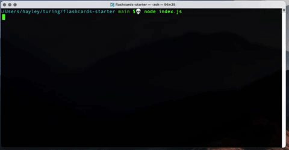

# Flashcards Starter

This is a program that can be run in a console that simulates a set of flash cards through the command line. A user will be able to see the questions, take guesses, and see a final score at the end of the round.

## Motivation and rubric

This project was completed as a project at Turing School of Software & Design during Module 2.

[The rubric is linked here.](https://frontend.turing.edu/projects/flash-cards.html)

## Reflections

A great challenge for this project was learning how to write TDD tests. However, once I started, they began coming naturally, and seeing the program functioning was a big win.

Getting a large number classes to work together was also a learning experience, but the project made for a beneficial creative outlet.

## Languages

Written in JavaScript (Mocha, Chai)

## Technology used

Built with Visual Studio Code

Code stored on GitHub

[Project Board on Trello](https://trello.com/b/fNj5wUIf)

## Install/Setup Instructions

The code is available at on GitHub [here](https://github.com/hayleyw7/flashcards-starter-2).

To use, clone the repo onto your local machine, open the terminal, navigate to the file, and enter `node index.js`.

The user starts is presented with a flashcard, which consists of a question and three possible answers. They must select an answer by using keyboard arrows and then pressing "Enter" or "Return" on their keyboard. The user will be then told if their answer was correct or incorrect.

Once all questions are complete, the game will end the game, and tell the user what percent of answers that they got correct.

## GIF

 

// ADD THIS

## Future Additions

* The user will need to answer correctly 90% of the time, or they will have to go through the cards again.

* A timer will keep track of how long it took the user to complete the flashcards.

## Contributor

Project completed by [Hayley Witherell](https://github.com/hayleyw7)
